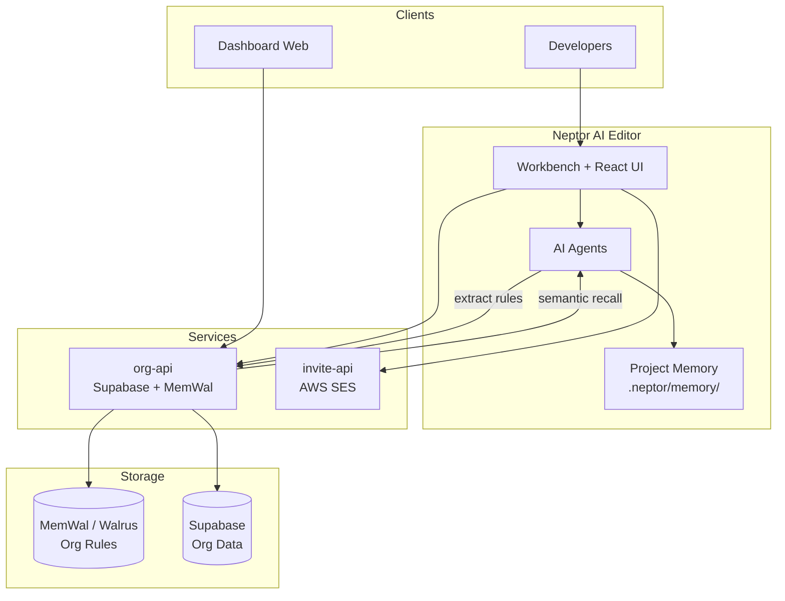

<div align="center">

# Neptor AI

**The operating system for AI-native engineering teams**

Build · Collaborate · Remember · Deploy

<br />

[](product.json)
[](LICENSE.txt)
[](#quick-start)

[What is Neptor?](#what-is-neptor-ai) · [MemWal](#memwal-persistent-organization-memory) · [Features](#core-features) · [Architecture](#architecture) · [Quick Start](#quick-start)

</div>

---

## What is Neptor AI?

Neptor AI is an AI-native development workspace built on a modern code editor foundation. It unifies **coding**, **team collaboration**, **project intelligence**, **organizational memory**, and **deployment workflows** into one environment, so AI agents understand not just your repository, but **how your team builds software**.

Most AI coding tools are excellent at generating snippets inside a single chat. Neptor is designed for something harder: **continuity**. Conventions, architecture decisions, testing standards, and workflow preferences should persist across developers, sessions, and projects.

That continuity is powered by **MemWal**, a semantic memory layer backed by Walrus storage, and by **Project Memory**, a structured markdown knowledge base inside `.neptor/memory/` that coding agents can read and update over time.

---

## The problem

Engineering teams accumulate knowledge that rarely survives the next chat window:

| What teams know | What most AI tools do |
|-----------------|----------------------|
| Coding standards & naming conventions | Forget after the session ends |
| Architecture decisions (ADRs) | Must be re-explained every time |
| Testing & review practices | Produce inconsistent output |
| Deploy & infra constraints | Ignore until something breaks |
| Onboarding context | Rebuilt manually for each hire |

The result: repeated prompting, inconsistent AI output, slower onboarding, and lost institutional knowledge.

Neptor treats team knowledge as **first-class infrastructure**, not disposable chat context.

---

## MemWal: persistent organization memory

**MemWal** (Walrus Memory) is Neptor's long-term memory layer for **organization-wide rules**. When developers state preferences during AI interactions, for example *"All APIs must follow the repository pattern"*, Neptor extracts, categorizes, and stores those rules in MemWal.

On future requests, relevant rules are **semantically recalled** and injected into prompts before code generation begins. No copy-pasting the same instructions into every conversation.

### How it works

1. **Capture**: Neptor identifies durable engineering knowledge from chat and team activity.
2. **Categorize**: Rules are tagged (e.g. `backend`, `architecture`, `testing`, `security`).
3. **Store**: MemWal persists each rule on Walrus with semantic indexing for recall.
4. **Recall**: Before the AI acts, Neptor retrieves the most relevant organizational rules.
5. **Apply**: Generated code, refactors, and reviews align with team standards automatically.

### Example

> **Week 1**: Developer A: *"We always use Zod for API validation."*  
> Neptor stores this as an org rule in MemWal.

> **Week 2**: Developer B asks the AI to scaffold a new endpoint.  
> Neptor recalls the Zod rule and generates validation accordingly, without Developer B restating it.

### Rule categories

MemWal supports categorized rules across domains including: `coding`, `architecture`, `frontend`, `backend`, `api`, `database`, `infrastructure`, `devops`, `security`, `testing`, `performance`, `observability`, and more.

---

## Project memory

Beyond org-wide rules, Neptor maintains **per-project memory** under `.neptor/memory/`, structured markdown artifacts that give coding agents durable context about a specific codebase.

| Artifact | Purpose |
|----------|---------|
| `architecture.md` | Repo layout, frameworks, conventions, deploy paths, critical entrypoints |
| `overview.md` | Short continuity snapshot for rejoining sessions quickly |
| `tech_stack.md` | SDKs, package managers, CI/CD, infra, databases |
| `code_style.md` | Naming, linting, TS strictness, testing patterns |
| `tasks.md` | Active work, touched files, TODOs, rejected approaches |
| `apis.md` | Service boundaries, contracts, versioning, things that must not regress |
| `file_graph.md` | Module coupling, imports, brittle edges |
| `fixes.md` | Past bugs and working fixes, highest-ROI "do not repeat" memory |
| `workflow.md` | Commands, git flow, branching, debugging habits |
| `decisions.md` | ADR-style rationale for architectural choices |
| `domain.md` | Entities, invariants, ubiquitous language |
| `flows.md` | Critical sequences including failure and retry paths |
| `roadmap.md` | Engineering-facing milestones tied to code direction |

Agents can **read, generate, and update** these files during Product Workspace sessions, so project knowledge compounds instead of evaporating.

---

## Core features

### AI-native code editor

- Inline autocomplete and quick-edit flows powered by configurable LLM providers
- Chat sidebar with thread management and markdown rendering
- Command bar, selection helpers, and editor widgets for fast AI-assisted edits
- Intelligent model routing: pick the right model per task (Anthropic, Google, OpenAI-compatible, local via Ollama, and more)
- MCP (Model Context Protocol) server integration for external tools and data sources

### Product workspace

- Requirements, documentation, and architecture discussions alongside your code
- Memory bootstrap wizard to rebuild project knowledge from the codebase
- Mermaid diagrams for architecture, flows, and domain models
- Agent Git Tracker: inspect AI-generated diffs and roll back when needed

### Team collaboration

- Organizations with invite flows and member management
- Real-time collaboration activity panels
- Org-scoped rule sync via the org API
- Extension transfer between team environments

### Deployment

- Built-in deploy wizard for cloud targets (AWS, Azure, GCP, and others)
- Workspace lifecycle management from editor to production

### Workspace intelligence portal

- Standalone `dashboard-web` service for org and workspace visibility outside the editor

---

## Architecture



### Repository layout

```text
neptor-sui/
├── src/vs/workbench/contrib/neptor/   # Neptor editor integration (services, React UI)
├── tools/
│   ├── org-api/                       # Org rules, activity, MemWal sync (Supabase)
│   └── invite-api/                    # Organization invite emails (AWS SES)
├── dashboard-web/                     # Workspace intelligence portal
├── extensions/                        # Bundled VS Code language extensions
├── build/                             # Compile pipeline & tooling
└── scripts/                           # Launch scripts (code.sh, etc.)
```

---

## Quick start

### Prerequisites

- **Node.js** v20.18.1 or later
- **npm** (yarn is not supported in this repo)
- **Python 3** (for some build steps)
- Platform build tools (Xcode CLI on macOS, build-essential on Linux, VS Build Tools on Windows)

### Run the editor

```bash
# Install dependencies
npm install

# Development: watch + launch (recommended)
npm run watch
./scripts/code.sh

# Or one-shot build + launch
npm run launch-neptor
```

### Run backend services (optional)

Each service has its own `.env.example`. Copy to `.env` and fill in credentials.

**Org API** (team rules, MemWal, Supabase), default port `8788`:

```bash
cd tools/org-api
cp .env.example .env
npm install
npm start
```

**Invite API** (organization invites via SES), default port `8787`:

```bash
cd tools/invite-api
cp .env.example .env
npm install
npm start
```

**Dashboard web**, workspace intelligence portal:

```bash
cd dashboard-web
cp .env.example .env
npm start
```

### MemWal configuration

For persistent org rules on Walrus, set in `tools/org-api/.env`:

```env
MEMWAL_PRIVATE_KEY=...
MEMWAL_ACCOUNT_ID=...
```

Without these, org rules fall back to Supabase-only storage.

---

## Typical workflow

1. **Create an organization** and invite teammates.
2. **Open a workspace** in the Neptor editor.
3. **Collaborate with AI**: code, review, plan, and document in one place.
4. **Neptor extracts knowledge**: conventions and decisions flow into MemWal and project memory.
5. **Future sessions recall context**: org rules and `.neptor/memory/` artifacts inform every agent action.
6. **Deploy** when ready, using the built-in deploy wizard from Product Workspace.

---

## Tech stack

| Layer | Technologies |
|-------|--------------|
| Editor shell | Electron, TypeScript, VS Code OSS fork |
| Neptor UI | React, Tailwind CSS, tsup |
| AI providers | Anthropic, Google GenAI, OpenAI-compatible APIs, Ollama |
| Org memory | MemWal (`@mysten-incubation/memwal`), Walrus |
| Org data | Supabase, Node.js HTTP services |
| Invites | AWS SES |
| Protocols | MCP (Model Context Protocol) |

---

## What makes Neptor different?

| Typical AI coding tool | Neptor AI |
|------------------------|-----------|
| Remembers the current chat | Remembers **how your team builds** |
| Stateless between sessions | **MemWal** + project memory persist across sessions |
| Generic code generation | Context-aware output aligned with org rules |
| Docs live elsewhere | **`.neptor/memory/`** lives with the repo |
| Solo developer focus | **Organizations**, invites, collaboration, deploy |

---

## Vision

We believe the next generation of developer tools will not just generate code. They will **understand engineering culture**: the standards, decisions, and habits that make a team effective.

Neptor AI is built to make that understanding **durable, shared, and compounding** with every interaction.

---

<div align="center">

**Neptor AI**: *The operating system for AI-native teams*

[Report an issue](https://github.com/neptorai/neptor/issues/new) · [neptor.ai](https://neptor.ai)

</div>
